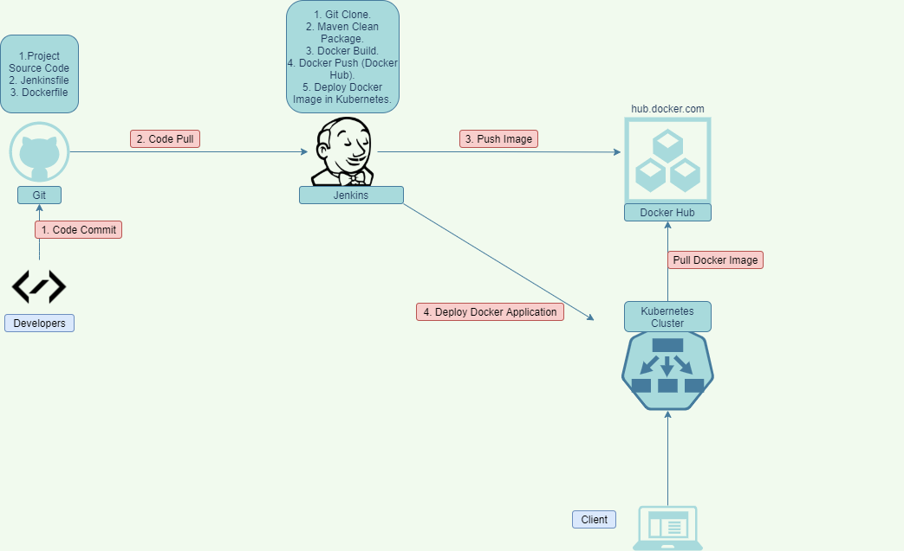
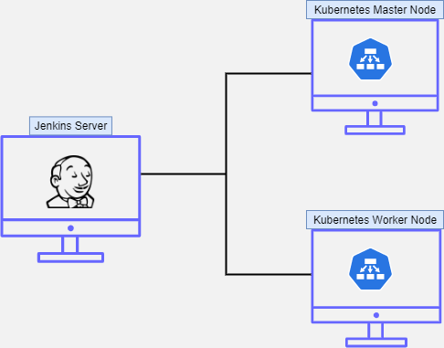
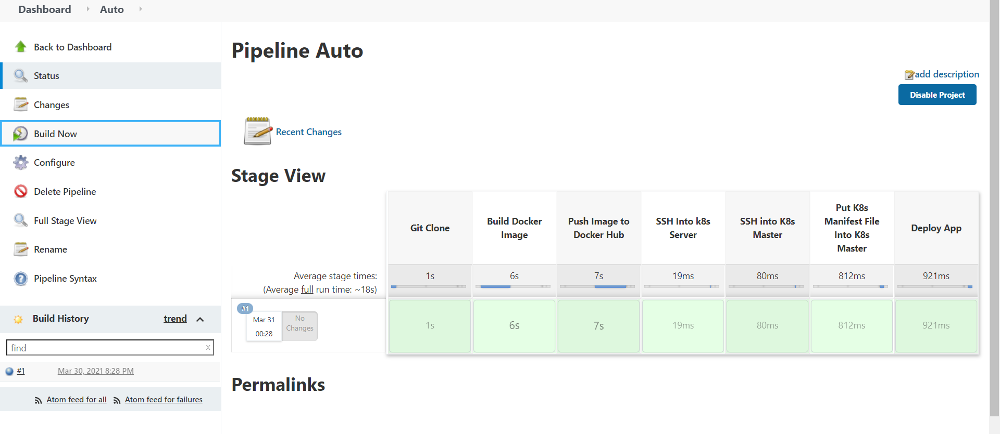
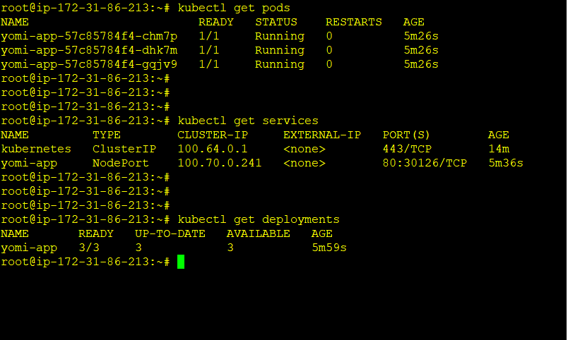
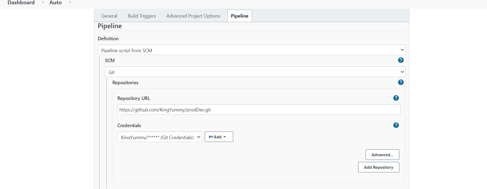

# Automated CI/CD Pipeline Using Jenkins, Docker Hub, and Kubernetes

A completely automated CI/CD pipeline project that
1. Continuously pulls the latest source code from the repository (Github) whenever a change is made by the developers
2. Build the latest code and create a docker image using the Dockerfile
3. Push the new Docker image to a remote repository (Docker Hub)
4. Deploys app (dockerized) to a Kubernetes Cluster.



 
 
## Technologies

-GitHub, Jenkins, Docker, DockerHub, and Kubernetes Cluster to achieve this.

In this project a seperate jenkins server is integrated with a kubernetes cluster using the SSH Pipeline plugin in jenkins





-Requirements: As seen in the sketch 
1. jenkins server  
2. kubernetes cluster (kubernetes master and worker nodes)

-In summary the Jenkins server will connect to kubernetes master and worker nodes for the continuous deployment.


## Step 1

-Developer commit code: At this stage the developers pushes the completed source code to the the Git repository

## Step 2

-Jenkins Pull Code: A webhook connection is created between the Git repository and the jenkins server. This means that anytime a change is commited to the repository, the jenkinsjob is triggered to pull the updated code to the server.

-Cases: Depending on the type of app being developed, the next stage would be to build the code using maven/gradle.

## Step 3

-Build and Push Docker Image to DockerHub: Jenkins then build the docker image using the Dockerfile


```
docker build -t ImageName
```

-The new image is then pushed to the remote repository: Docker Hub 


```
docker push ImageName
```
 
## Step 4.

-Deploy The Dockerized Application to The Kubernetes Cluster: Using the Kubernetes Continuos Deploy plugin or SSH Pipeline plugin the application is deployed to the Kubernetes cluster.




## Troubleshoot

-Using the kubectl get commands you can verify the deployment and pods


```
kubectl get deployments
kubectl get pods
kubectl get services
```




## Final

 -Create a new jenkins job too run the jenkinsfile as soon as the git clone is completed
 


## Summary

-Complete jenkinfiles illustrating the process in stages
 
 ```Groovy
 node{
    
    stage("Git Clone"){
        git credentialsId: 'GIT_CREDENTIALS', url: 'https://github.com/KingYummy/prodDev.git'
    }
    
    stage("Build Docker Image"){
        sh "docker version"
        sh "docker build . -t ImageName"
        sh "docker image list"
    }
    
    stage("Push Image to Docker Hub"){
        withCredentials([string(credentialsId: 'DOCKER_HUB_CREDENTIALS', variable: 'DOCKER_HUB_CREDENTIALS')]) {
            sh "docker login -u username -p ${DOCKER_HUB_CREDENTIALS}"
        }
        sh "docker push ImageName "
    }
    
    stage("SSH Into k8s Server") {
        def remote = [:]
        remote.name = 'K8S master'
        remote.host = 'K8s IP'
        remote.user = 'username'
        remote.password = 'password'
        remote.allowAnyHosts = true
        
        stage("SSH into K8s Master") {
			  withCredentials([sshUserPrivateKey(credentialsId: 'ssh2', keyFileVariable: 'identity', passphraseVariable: '', usernameVariable: 'username')]) {
				  remote.user = username
				  remote.identityFile = identity
				  
				  stage('Put K8s Manifest File Into K8s Master') {
				      sshPut remote: remote, from: './prodDevDeploy.yaml', into: '.'
				  }
				  
				  stage('Deploy App') {
				      sshCommand remote: remote, command: "kubectl apply -f prodDevDeploy.yaml"
				  }
        
			  }
        }  
    }
      
    
}
```


